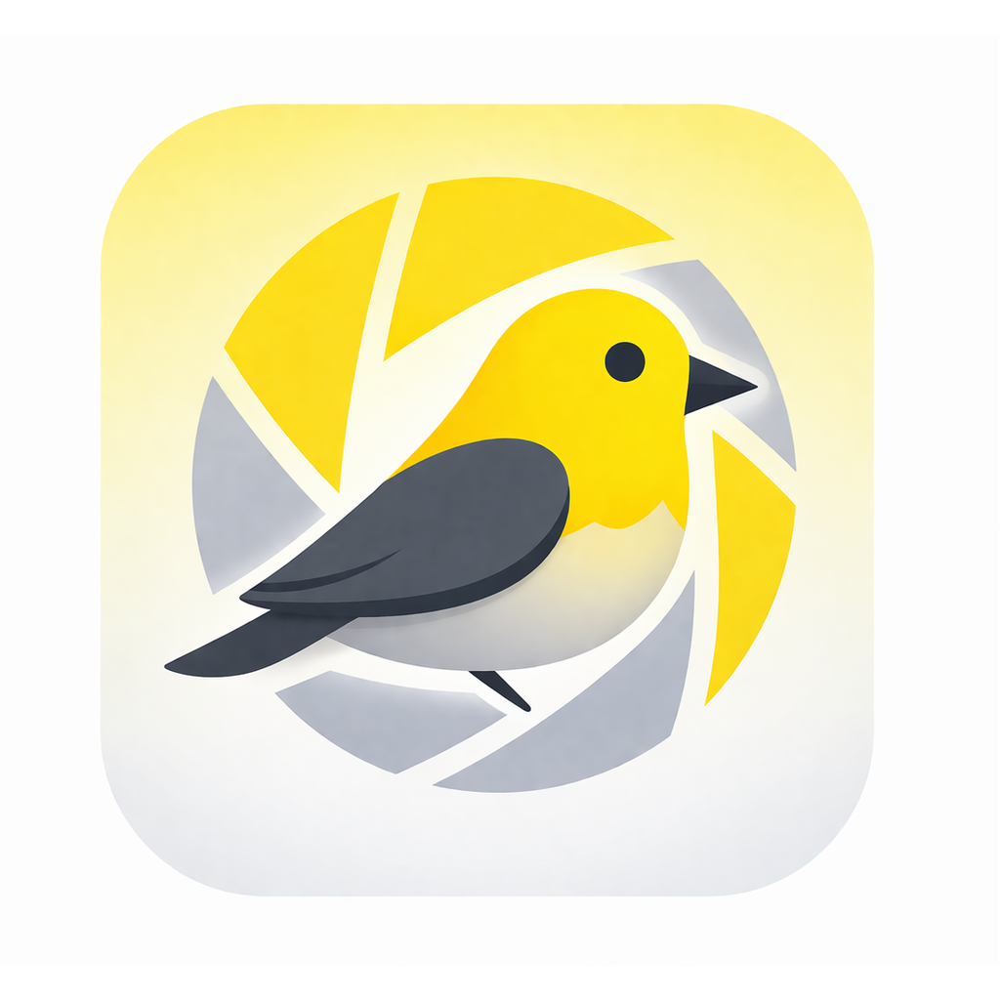

<p align="center">
  
</p>

<h1 align="center">Vireo</h1>

<p align="center">
  AI-powered wildlife photo organizer that respects your filesystem and never hides what it's doing.
</p>

---

Vireo helps wildlife photographers triage thousands of photos using machine learning. It detects animals, identifies species, scores image quality, groups photos into encounters, and recommends which to keep — all while storing metadata in standard XMP sidecars so you're never locked in.

## Features

- **Species classification** — Multiple models including BioCLIP, BioCLIP-2, BioCLIP-2.5, and an iNat21 fine-tuned classifier covering 10K+ species
- **Wildlife detection** — MegaDetector v6 for animal/person/vehicle localization
- **Automated triage pipeline** — Groups photos into encounters and bursts, scores quality (sharpness, exposure, composition, noise), and labels each photo KEEP/REVIEW/REJECT
- **Selectable subjects** — Each retained animal gets a suggested crop, species predictions, a quality score, and an exposure suggestion. Vireo chooses the best-quality subject; choose another in the lightbox without changing your saved edits.
- **Subject-aware quality scoring** — Uses SAM2 segmentation masks and DINOv2 embeddings to evaluate the actual subject, not just the frame
- **iNaturalist integration** — Taxonomy lookup and direct observation uploads
- **Browse, review, and cull** — Filter, search, rate, keyword, and flag photos in a responsive web UI
- **[Search across metadata](docs/searching-photos.md)** — Combine words with AND, OR, NOT, parentheses, and quoted phrases across file tags, folders, keywords, camera details, and current predictions
- **Non-destructive photo editing** — Adjust geometry, tone, white balance, detail, five-point curves, individual color ranges, and shadow/midtone/highlight grading with reusable presets
- **RAW editing with greater precision** — Keep decoded RAW pixels in floating point through editing, retain highlight detail for exposure adjustments, and export 16-bit TIFFs. See [RAW development](docs/raw-development.md) for processing details and fallback limitations.
- **[Camera-aware denoising](docs/camera-aware-denoising.md)** — Optional camera/ISO-guided noise reduction with image-based fallback, luminance and color filtering, and support for local subject/background edits
- **Panorama stitching** — Select 2–12 overlapping photos in Browse, then choose **More → Create Panorama** (also available by right-click). Includes current edits and saves a separate JPEG or PNG without overwriting existing files. Choose an existing output folder or save beside the first selected photo, then rescan that folder to add the result to Browse. Inputs are limited to 2,048 or 4,096 pixels on the long edge; output is 8-bit color and may need cropping to remove black borders. Follow progress or cancel in Jobs; cancellation takes effect after the current stitching stage.
- **Map view** — Geographic visualization of geotagged photos
- **Photo location review** — In Review Photo Locations, choose **Missing GPS · group by time** to review suggested outings across all available photos or a collection. Preview examples, inspect and split groups, and assign a saved place or custom name in batches. Also available from Browse’s **Add Locations by Capture Time** menu action.
- **GPS discrepancy review** — Choose **GPS differs from assigned place** in Review Photo Locations to compare photo GPS with assigned places on a map. Adjust the distance threshold (500 meters by default), select photos, and keep their GPS or queue the assigned coordinates for metadata sync. Skipping makes no changes. Kept decisions can be revisited; corrections remain reviewable until written to XMP, and original photo GPS is preserved.
- **Workspaces** — Isolated projects with independent predictions, collections, and settings
- **Lightroom migration** — Import keyword hierarchies from `.lrcat` catalogs via XMP sidecars
- **Transparent by design** — Live log panel, job progress streaming, pipeline inspector, and full audit system

## Philosophy

- **XMP is truth, the database is a cache.** The SQLite database can be rebuilt from your filesystem at any time.
- **Show the user what's happening.** No black boxes — every scan, download, classification, and failure is visible.
- **Work with the ecosystem.** Import from Lightroom, sync to XMP, submit to iNaturalist. Vireo orchestrates; it doesn't try to own the pipeline.

See [CORE_PHILOSOPHY.md](CORE_PHILOSOPHY.md) for more.

## Getting started

For downloads, system requirements, and user documentation, visit [vireo.photo](https://vireo.photo).

AI models are downloaded automatically on first use.

64-bit Windows 11 is supported with CPU inference. See
[the Windows support guide](docs/WINDOWS_SUPPORT.md) for optional integrations,
storage coverage, and troubleshooting.

## Developing from source

### Requirements

- Python 3.14+
- A GPU is recommended for classification but not required

### Install for development

```bash
git clone https://github.com/jss367/vireo.git
cd vireo
pip install -e ".[dev]"
```

For a development environment using the committed dependency versions:

```bash
uv sync --locked --extra dev
```

With this environment, prefix the Python commands below with
`uv run --locked --extra dev`.

Pose model conversion requires separate environments; see the
[pose model export setup](scripts/model-export/README.md).

### Run

```bash
python vireo/app.py --db ~/.vireo/vireo.db --port 8080
```

Then open [http://localhost:8080](http://localhost:8080).

## Tests

```bash
python -m pytest tests/ vireo/tests/ -q
```

The full unit suite is ~7.5k tests (3-4 minutes locally on all cores). To run
only the tests your branch can affect, download the per-test coverage map
that the post-merge "Full tests" workflow publishes, then let the selector
map your diff onto it:

```bash
python scripts/select_tests.py fetch-map          # once per day or so; needs `gh`
python scripts/select_tests.py --run -- -n auto -q
```

`select_tests.py --explain` shows why each changed file selected what it
did. PR CI runs the same selection on Linux; the complete suite on all three
OSes runs after merge (`.github/workflows/test-main.yml`). Add the
`ci-full-suite` label to a PR to force the full suite there. Module-level,
structurally ambiguous, and test-harness changes also use the full-suite
fallback because import-time dependencies cannot be narrowed safely from line
coverage.

For offline grouping experiments with cached predictions and current human labels,
see the [encounter evaluation tool](tools/encounter-evaluation/README.md). It has a
separate development environment and is excluded from the application bundle.

## Scripting & automation

Vireo exposes a small stable HTTP API under `/api/v1` for scripts and agents. A running instance advertises its port and auth token via `~/.vireo/runtime.json`. See [docs/headless-api.md](docs/headless-api.md) for discovery, spawning a headless instance, authentication, and a worked `curl` example.
